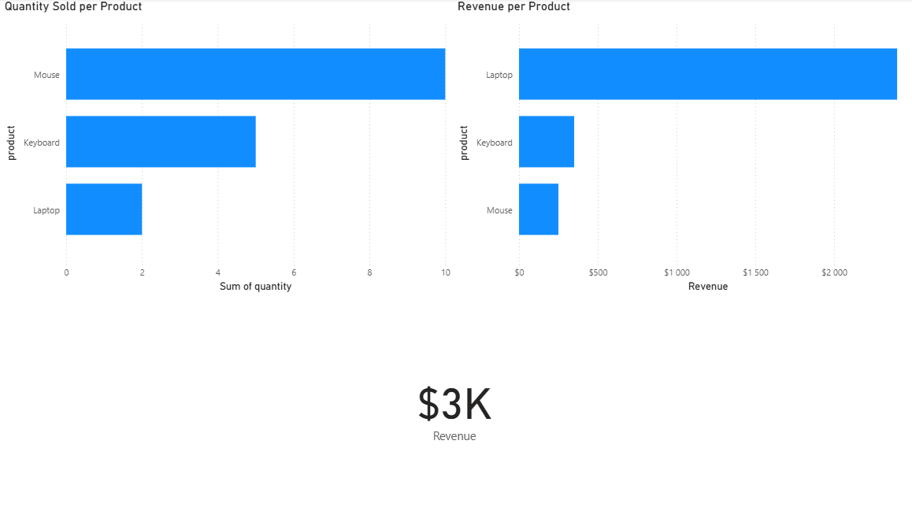

# Data Engineering Project (AWS + Power BI)

## Overview

This project demonstrates an end-to-end data pipeline using Python, AWS RDS, and Power BI.

## Tech Stack

* Python
* AWS RDS (PostgreSQL)
* pgAdmin
* Power BI

## Steps

1. Generated dataset using Python
2. Uploaded data to AWS RDS
3. Queried data using pgAdmin
4. Built dashboard in Power BI

## Dashboard Features

* Revenue per product
* Quantity sold per product
* Total revenue KPI

## Screenshot

